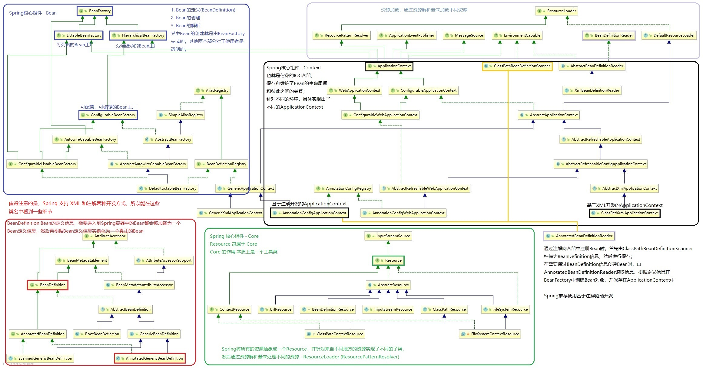

### Dive in Spring Framework

《Spring-framework 注解驱动开发》

---

主要的学习记录都在 cn.llman.config 文件夹中

由于是在IDEA中写的，所以用了很多{@link}的注释，方便源码的查看，所以建议使用IDEA打开食用

---

其中，较为难理解的，或者说较为复杂的是利用Spring实现的Aop机制

所以，这部分的内容要先理解大体的思路再进去看源码，不然有点晕

Spring AOP 的大体思路是：

1. 通过@EnableAspectJAutoProxy注解开启AOP功能支持，这个注解是一个组合注解，其中最重要的当属@Import注解

   @Import最终会向IOC容器中注册一个Bean(AnnotationAwareAspectJAutoProxyCreator)

2. 通过查看AnnotationAwareAspectJAutoProxyCreator的继承关系，可以得知这是一个InstantiationAwareBeanPostProcessor类型的后置处理器，这种类型的处理器和它的父类中总共定义了4个方法

3. 这4个方法，分别对应了Spring Bean产生过程中的两个阶段(实例化和初始化)

4. 在4个方法的拦截和包装下，将通知方法包装在了业务逻辑组件中，最终向IOC容器中返回一个业务逻辑组件的代理对象

   代理技术可以是JDK的动态代理，也可以是CGLib的代理技术

5. Bean的代理对象在IOC容器中创建完毕后，每次从容器中获取的都是代理对象。代理对象在执行逻辑方法时，会将逻辑方法和通知方法组装成一个执行链(Chain)，然后通过链式调用(递归调用)的过程，保证了通知方法和逻辑方法的执行顺序

大致就是上面的，分为两个阶段：

- 代理对象的产生
  - 后置处理器的注册
  - 在后置处理器的帮助下产生代理对象
- 代理对象执行方法

---

Spring 核心组件的协作，如上图所示。Bean 是 Spring 的核心，可以认为 Spring 是面向 Bean 编程的一门技术，所以一切与 Bean 相关的部分就尤为重要。首先是 BeanFactory ，这是产生 Bean 的地方，根据不同的特性，可以分出好几种 Bean 工厂；经由工厂产生的 Bean 需要统一存放到一个位置，进行管理和维护，此时就需要 Context，从上图中可以看出，ApplicationContext 实现了 BeanFactory 的子接口，也说明了 Context 是具备 Factory 的相应功能；最后的一个组件 Spring-Core 看似与前两个组件没有直接的继承关系，但基本上 Spring 中所有的组件都需要使用到 Core 中的工具方法，所以 Core 本质上就是一个工具方法的集合，所以称它为 Spring-Utils 更容易理解。